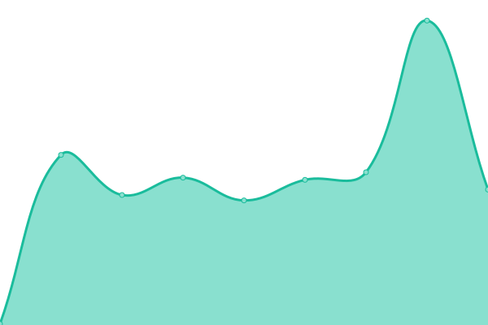

# [📈 Live Status](https://upptime.github.io/upptime): <!--live status--> **🟧 Partial outage**

This repository contains the open-source uptime monitor and status page for [Upptime](https://upptime.js.org), powered by [Upptime](https://github.com/upptime/upptime).

With [Upptime](https://upptime.js.org), you can get your own unlimited and free uptime monitor and status page, powered entirely by a GitHub repository. We use [Issues](https://github.com/upptime/upptime/issues) as incident reports, [Actions](https://github.com/cleyan/status-umas/actions) as uptime monitors, and [Pages](https://upptime.github.io/upptime) for the status page.

<!--start: status pages-->
<!-- This summary is generated by Upptime (https://github.com/upptime/upptime) -->
<!-- Do not edit this manually, your changes will be overwritten -->
<!-- prettier-ignore -->
| URL | Status | History | Response Time | Uptime |
| --- | ------ | ------- | ------------- | ------ |
|  [UMASNet](https://twk.umas.cl/umasnet) | 🟩 Up | [umas-net.yml](https://github.com/cleyan/status-umas/commits/HEAD/history/umas-net.yml) | 

 1732ms
     
 | 

<a href="https://status.twk.cl/history/umas-net">100.00%</a>
    

|  [Portal Alumnos](https://portalalumnos.twk.cl) | 🟥 Down | [portal-alumnos.yml](https://github.com/cleyan/status-umas/commits/HEAD/history/portal-alumnos.yml) | 

 0ms
     
 | 

<a href="https://status.twk.cl/history/portal-alumnos">0.00%</a>
    

|  [Portal Docentes](https://portaldocentes.twk.cl) | 🟥 Down | [portal-docentes.yml](https://github.com/cleyan/status-umas/commits/HEAD/history/portal-docentes.yml) | 

 0ms
     
 | 

<a href="https://status.twk.cl/history/portal-docentes">0.00%</a>
    

|  [Portal Titulados](https://portaltitulados.twk.cl) | 🟥 Down | [portal-titulados.yml](https://github.com/cleyan/status-umas/commits/HEAD/history/portal-titulados.yml) | 

 0ms
     
 | 

<a href="https://status.twk.cl/history/portal-titulados">0.00%</a>
    

|  [Matrícula no presencial Alumnos Nuevos](https://twk.umas.cl/mnp) | 🟥 Down | [matricula-no-presencial-alumnos-nuevos.yml](https://github.com/cleyan/status-umas/commits/HEAD/history/matricula-no-presencial-alumnos-nuevos.yml) | 

 132ms
     
 | 

<a href="https://status.twk.cl/history/matricula-no-presencial-alumnos-nuevos">0.00%</a>
    

|  [matrícula No presencial Alumnos antíguos](https://twk.umas.cl/mnpaa) | 🟥 Down | [matricula-no-presencial-alumnos-antiguos.yml](https://github.com/cleyan/status-umas/commits/HEAD/history/matricula-no-presencial-alumnos-antiguos.yml) | 

 132ms
     
 | 

<a href="https://status.twk.cl/history/matricula-no-presencial-alumnos-antiguos">0.00%</a>
    

|  [webService UmasNet](https://twk.umas.cl/wsInterfazUsrTwk/Service1.asmx?WSDL) | 🟩 Up | [web-service-umas-net.yml](https://github.com/cleyan/status-umas/commits/HEAD/history/web-service-umas-net.yml) | 

 395ms
     
 | 

<a href="https://status.twk.cl/history/web-service-umas-net">100.00%</a>
    

|  [Intranet TWK](https://intranet.twk.cl) | 🟩 Up | [intranet-twk.yml](https://github.com/cleyan/status-umas/commits/HEAD/history/intranet-twk.yml) | 

 488ms
     
 | 

<a href="https://status.twk.cl/history/intranet-twk">100.00%</a>
    

|  [Service API TWK](https://service.twk.cl) | 🟩 Up | [service-api-twk.yml](https://github.com/cleyan/status-umas/commits/HEAD/history/service-api-twk.yml) | 

 292ms
     
 | 

<a href="https://status.twk.cl/history/service-api-twk">100.00%</a>
    

|  [CRM xACADEMI](https://crm.xacademi.com/) | 🟥 Down | [crm-x-academi.yml](https://github.com/cleyan/status-umas/commits/HEAD/history/crm-x-academi.yml) | 

 131ms
     
 | 

<a href="https://status.twk.cl/history/crm-x-academi">21.00%</a>
    

|  [AVEA](https://avea.cl/ping.php) | 🟥 Down | [avea.yml](https://github.com/cleyan/status-umas/commits/HEAD/history/avea.yml) | 

 204ms
     
 | 

<a href="https://status.twk.cl/history/avea">100.00%</a>
    

|  [Campus xACADEMI](https://campus.xacademi.com/) | 🟥 Down | [campus-x-academi.yml](https://github.com/cleyan/status-umas/commits/HEAD/history/campus-x-academi.yml) | 

 130ms
     
 | 

<a href="https://status.twk.cl/history/campus-x-academi">20.86%</a>
    

<!--end: status pages-->

[**Visit our status website →**](https://status.twk.cl)

## 📄 License

- Powered by: [Upptime](https://github.com/upptime/upptime)
- Code: [MIT](./LICENSE) © [Upptime](https://upptime.js.org)
- Data in the `./history` directory: [Open Database License](https://opendatacommons.org/licenses/odbl/1-0/)
